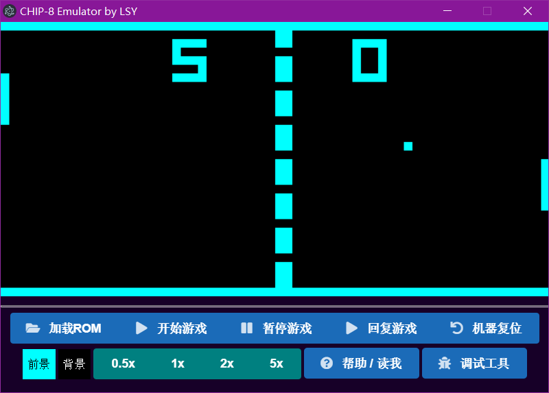
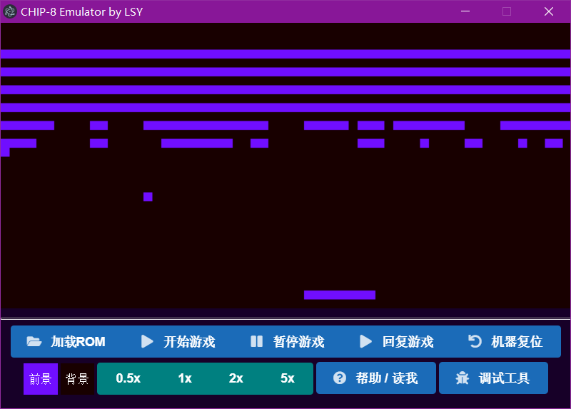
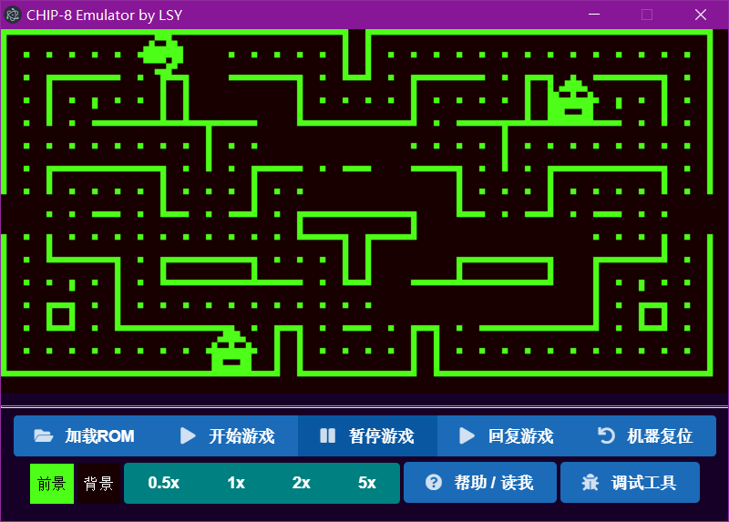
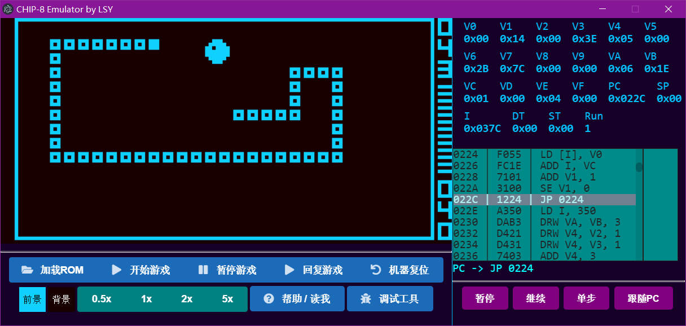
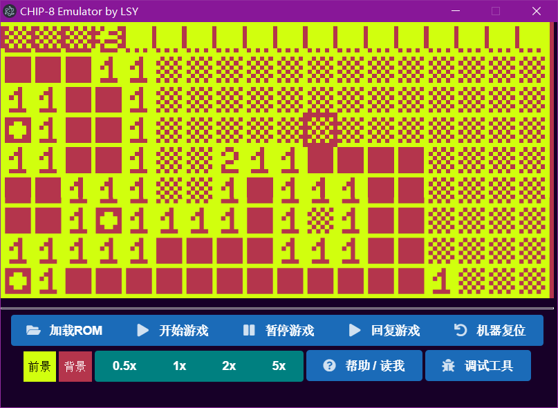
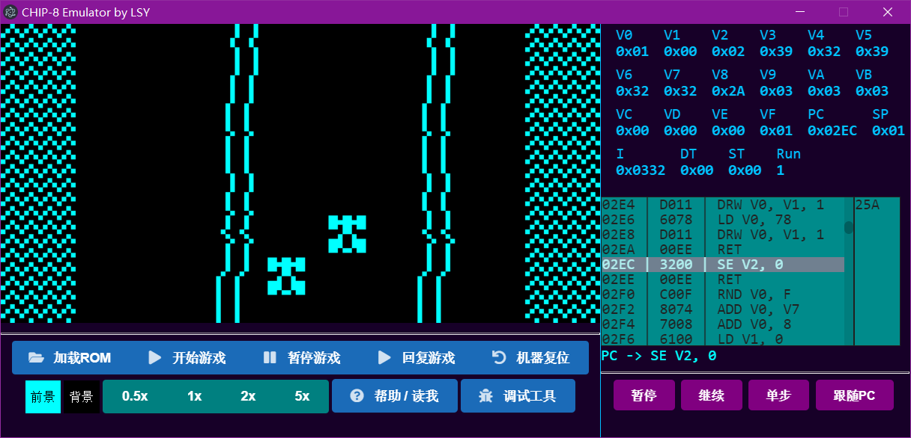

# JSCHIP-8 Emulator

[CHIP-8](https://en.wikipedia.org/wiki/CHIP-8) 是一套 70 年代中期微机上的指令集，设计简单，有较为详细的[文档](http://devernay.free.fr/hacks/chip8/C8TECH10.HTM)。 作为计算机组成原理课程设计的项目，我用 JS 实现了一个 CHIP-8 模拟器，同时也支持 [Super CHIP](http://devernay.free.fr/hacks/chip8/schip.txt) 扩展指令集。

有关实现的细节请参考[文档](doc/JSCHIP-8_doc.pdf)。

## Release

如果只是想玩一玩游戏，请直接下载二进制文件：

Directly download the binaries if you are just playing around:

[JSCHIP-8 Releases](https://github.com/ssine/JSCHIP-8/releases)

执行 `run.bat` 或 `electron/jschip8.exe` 以运行。

run `run.bat` or `electron/jschip-8.exe`.

## 截图

可玩的 CHIP-8 游戏：


Super CHIP 游戏：


显示指令运行热区图：


简单结构说明：


游戏运行截图：

<table>
  <tbody>
    <tr>
      <td></td>
      <td></td>
    </tr>
    <tr>
      <td></td>
      <td></td>
    </tr>
    <tr>
      <td></td>
      <td></td>
    </tr>
  </tbody>
</table>

## 安装说明

首先安装 Nodejs + npm

安装依赖：

```bash
npm install
```

启动

```bash
npm start
```

在安装依赖时大概会遇到很多问题（反正我是），主要出在 Electron 身上，建议尝试的解决方案：

1. 使用 cnpm
2. 给 npm 换源
3. 挂梯子
4. 使用管理员权限运行
5. 重新安装前清除 npm 缓存
